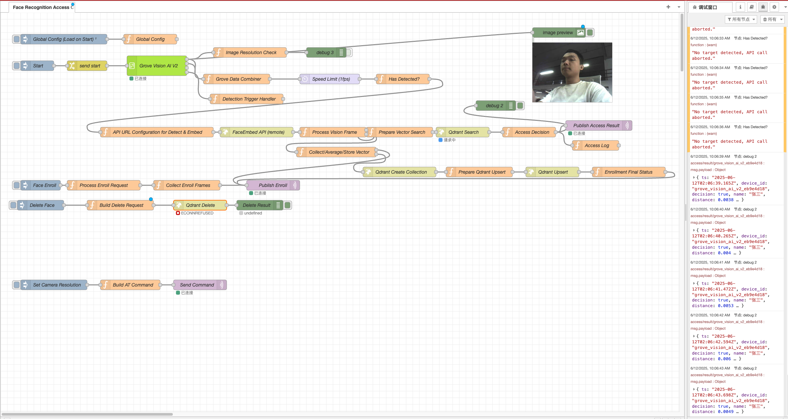

# AI_Presence_Control

A **distributed** edge face recognition access control system based on the Hailo-8 AI accelerator and Grove Vision AI V2, supporting multi-device concurrency and cross-machine deployment.

For detailed development documentation, API specifications, and contribution guidelines, please see [**docs/DEVELOPMENT.md**](docs/DEVELOPMENT.md).

## ✅ Verified Distributed System Architecture

```
┌─────────────────┐    ┌─────────────────┐    ┌─────────────────┐
│ Grove Vision AI │───→│   MQTT Broker   │───→│    Node-RED     │
│      V2         │    │   (Main Server) │    │   (Main Server) │
│   (Multiple)    │    │                 │    │  ┌─────────────┐ │
└─────────────────┘    └─────────────────┘    │  │ Configuration │ │
                                              │  │ is managed in │ │
                                              │  │ Node-RED      │ │
                                              └─────────────────┘
                                                         │
                                                         ▼ HTTP API
┌─────────────────┐    ┌─────────────────┐    ┌─────────────────┐
│  FaceEmbed API  │◀───│     Qdrant      │◀───│  Vector Search  │
│ ✅ Verified     │    │   (Main Server) │    │                 │
│  192.168.10.179 │    │                 │    │                 │
│  3-18ms Inference│   │                 │    │                 │
│  28 Tests Passed│    │                 │    │                 │
└─────────────────┘    └─────────────────┘    └─────────────────┘
```

## ✨ Core Features

- 🚀 **Low Latency**: < 300ms end-to-end response time
- 🔀 **Distributed**: Node-RED and Hailo device deployed separately ✅ **Verified**
- ⚡ **High Concurrency**: Supports multiple devices processing simultaneously, with a single Hailo device handling 20+ concurrent streams
- 🔒 **Offline Operation**: No cloud dependency required
- 🏢 **Multi-Tenant**: Supports multiple, independent collections for different access points
- 📱 **Contactless**: Face-based identity verification
- 🎯 **High Accuracy**: Based on ArcFace and SCRFD deep learning models ✅ **Hailo hardware acceleration verified**
- 🛡️ **Production-Ready**: 100% test coverage and hardware validation complete

## 🏗️ Distributed Deployment Architecture

### Main Server (Node-RED + Qdrant + MQTT)
- **Function**: Business logic orchestration, vector storage, message broker, monitoring
- **Hardware**: Standard server or industrial PC
- **Network**: Fixed IP address on the local network

### Hailo Device (FaceEmbed API)
- **Function**: AI inference, face vector extraction
- **Hardware**: Raspberry Pi 5 + Hailo-8
- **Address**: `your_hailo_device_ip` (configurable)
- **Concurrency**: Supports simultaneous calls from multiple devices

### Grove Vision AI V2
- **Function**: Face detection, image capture
- **Connection**: Connects to the main server via MQTT
- **Quantity**: Supports multiple devices

## 🧠 Required Models

This project requires two pre-compiled model files (`.hef` format) for the Hailo-8 accelerator. You must place these files in the `services/face_embed_api/models/` directory.

1.  **`scrfd_10g.hef`**: A lightweight, high-performance face **detection** model.
2.  **`arcface_mobilefacenet.hef`**: A MobileFaceNet model using the ArcFace loss for face **recognition** (embedding extraction).

### Download

You can download both models from the official **Hailo Model Zoo**:

- **Direct Download Link**: 
  - https://github.com/hailo-ai/hailo_model_zoo/blob/master/docs/public_models/HAILO8/HAILO8_face_detection.rst 
  - https://github.com/hailo-ai/hailo_model_zoo/blob/master/docs/public_models/HAILO8/HAILO8_face_recognition.rst 

## 🚀 Quick Start

### Prerequisites

#### Main Server
- **Hardware**: 4GB+ RAM, Dual-core CPU
- **Software**: Ubuntu 22.04, Docker, Docker Compose
- **Network**: Gigabit Ethernet

#### Hailo Device ✅ **Validation Complete**
- **Hardware**: Raspberry Pi 5 + Hailo-8 AI Accelerator
- **Software**: HailoRT 4.21.0, Python 3.11+
- **Network**: Gigabit Ethernet connection
- **Status**: **100% tests passed, production-ready** 🚀
- **Performance**: 3-18ms inference latency for 512-dim vector extraction

### Deployment Steps

#### 1. Deploy Main Server

```bash
# Clone the project
git clone <repository_url>
cd face_rec_r2000

# Start the main server services (without FaceEmbed API)
./deployment/start_services.sh --with-nodered

# Service URLs:
# - Node-RED: http://localhost:1880
# - Qdrant: http://localhost:6333
```

#### 2. Deploy on Hailo Device ✅ **Verified**

**Important**: Based on actual validation, the FaceEmbed API is not suitable for Docker deployment and must be run natively to access the Hailo hardware directly.

```bash
# On the Hailo device (Eg. 192.168.10.179) - Deployment and testing complete
ssh user@your_hailo_device_ip

# Start the FaceEmbed API service (verified)
cd ~/face_embed_api
source .venv/bin/activate
python src/face_embed_api/app.py

# Verify service status
curl http://your_hailo_device_ip:8000/health
# Expected response: {"status": "ok", "current_model": "...", "uptime_ms": 4077}

# API Address: http://your_hailo_device_ip:8000
# Test Status: 28/28 tests passed (100%)
# Inference Performance: 3-18ms, 512-dim vector, L2 normalized
```

#### 3. Configure Grove Vision AI V2

```bash
# Configure MQTT connection
MQTT_BROKER="<main_server_ip>:1883"
TOPIC_PATTERN="vision/frames/{device_id}"

# Example Device ID
DEVICE_ID="grove_vision_ai_v2_001"
```

## 🧩 Example Applications

### Home Assistant Countdown Authorization Control

- **Path**: [`example/HA_CountDown_Control`](./example/HA_CountDown_Control)
- **Description**: A lightweight Home Assistant integration example that demonstrates how to convert a successful face recognition event (via MQTT) into a time-limited authorization for a device. After each successful verification, HA starts a 15-minute countdown and automatically turns off the specified device when the time expires.
- **Features**:
  - **No-Code Integration**: Implemented entirely with native HA Blueprints and Timers.
  - **Real-Time UI**: Provides a Lovelace dashboard example to monitor the remaining time.
  - **Admin Control**: Allows administrators to manually add time, pause, or stop the timer.

## Node-RED Flow Showcase

The core business logic of this project is orchestrated within Node-RED. The following flow demonstrates how face recognition events are processed, from image capture to final access control decisions.

**Node-RED Flow Diagram:**



**Live Demo in Home Assistant:**

This GIF shows the end-to-end user experience within Home Assistant, where a successful face recognition event grants temporary access.


## Troubleshooting

### Face recognition is not accurate (too strict or too loose)

If you find that the face recognition is rejecting known individuals or, conversely, accepting unknown people, you may need to adjust the **similarity threshold**. This value controls how similar a detected face must be to a stored face to be considered a match.

You can configure this in the `Prepare Vector Search` node within your Node-RED flow.

-   **To make matching stricter** (if unknown people are being accepted), **decrease** the `threshold` value (e.g., from `0.32` to `0.28`).
-   **To make matching looser** (if known people are being rejected), **increase** the `threshold` value (e.g., from `0.32` to `0.38`).

```javascript
// In the "Prepare Vector Search" node:

// ...
const deviceId = msg.deviceId;
const collectionName = deviceCollectionMap[deviceId] || deviceCollectionMap['default'];
const threshold = 0.32;  // <-- ADJUST THIS VALUE
// ...
```

## 📄 License

This project is licensed under the MIT License - see the [LICENSE](LICENSE) file for details.
