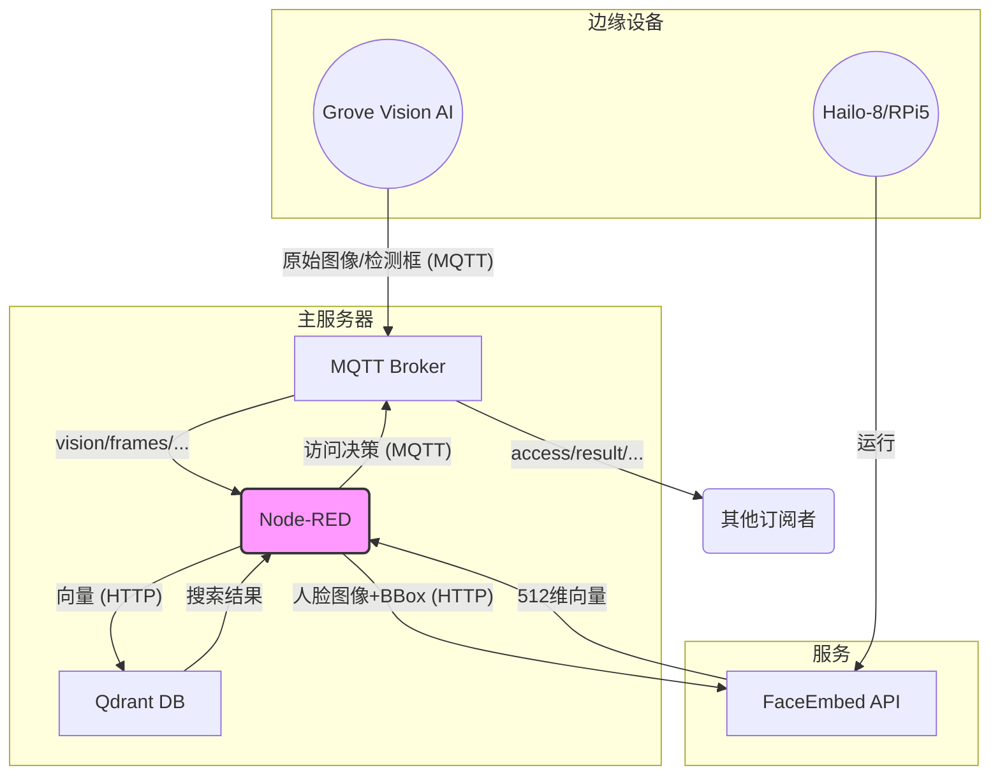

# 数据流与格式说明 (Data Flow & Format Documentation)

本文档详细说明了人脸识别权限控制系统中各个模块之间的数据流和核心数据格式。所有说明均基于当前代码实现。

## 目录
1.  [系统概览](#1-系统概览)
2.  [核心数据流](#2-核心数据流)
    *   [2.1 人脸识别流程](#21-人脸识别流程)
    *   [2.2 人脸入库流程](#22-人脸入库流程)
3.  [数据格式详解](#3-数据格式详解)
    *   [3.1 Grove Vision AI -> MQTT](#31-grove-vision-ai---mqtt)
    *   [3.2 Node-RED内部: 标准化视觉帧](#32-node-red内部-标准化视觉帧)
    *   [3.3 Node-RED -> FaceEmbed API](#33-node-red---faceembed-api)
    *   [3.4 FaceEmbed API -> Node-RED](#34-faceembed-api---node-red)
    *   [3.5 Node-RED -> Qdrant (向量搜索)](#35-node-red---qdrant-向量搜索)
    *   [3.6 Qdrant -> Node-RED (搜索结果)](#36-qdrant---node-red-搜索结果)
    *   [3.7 Node-RED -> MQTT (访问决策)](#37-node-red---mqtt-访问决策)
    *   [3.8 MQTT -> Node-RED (人脸入库)](#38-mqtt---node-red-人脸入库)
    *   [3.9 Node-RED -> Qdrant (入库)](#39-node-red---qdrant-入库)
    *   [3.10 Node-RED -> MQTT (入库状态)](#310-node-red---mqtt-入库状态)

---

## 1. 系统概览

系统的数据核心是**Node-RED**, 它负责编排所有服务：
-   从 **Grove Vision AI** (通过MQTT) 接收图像和检测框。
-   调用 **FaceEmbed API** (HTTP) 将人脸图像转换为向量。
-   在 **Qdrant** 向量数据库 (HTTP) 中搜索匹配的向量。
-   将最终的访问决策发布到 **MQTT**。
-   处理人脸入库请求，并将新的人脸向量存入 **Qdrant**。



## 2. 核心数据流

### 2.1 人脸识别流程

1.  **Grove Vision AI** 检测到人脸，将图像数据和检测框数据分别发送到 MQTT Broker。
2.  **Node-RED** 中的 `Grove数据整合器` 节点监听相应MQTT主题，将图像和检测框组合成一个标准化的JSON对象。
3.  `处理视觉帧` 节点从一帧中的多个人脸里选择面积最大的一个。
4.  `API URL 配置器` 节点准备好请求，并调用 `FaceEmbed API` 的 `/embed` 接口。
5.  **FaceEmbed API** 返回人脸的512维向量。
6.  `准备向量搜索` 节点构建Qdrant的搜索请求。
7.  `Qdrant搜索` 节点调用Qdrant的搜索接口。
8.  `访问决策` 节点根据Qdrant返回的结果，判断是否匹配成功，并生成最终的决策消息。
9.  `发布访问结果` 节点将决策消息发布到MQTT的 `access/result/{device_id}` 主题。

### 2.2 人脸入库流程

1.  外部系统 (如管理后台) 向MQTT主题 `access/enroll/{device_id}` 发布一条入库指令。
2.  **Node-RED** 的 `处理入库请求` 节点接收指令，并设置一个"收集中"的状态。
3.  当该 `device_id` 的摄像头捕捉到人脸时，`处理视觉帧` 节点会将其路由到入库流程。
4.  `FaceEmbed API` 被调用以提取人脸向量。
5.  `收集/平均/存储向量` 节点会收集10个向量，计算它们的平均值，以生成一个更具代表性的向量。
6.  该节点准备Qdrant的"创建集合"(如果不存在)和"插入点"的请求。
7.  请求被发送到**Qdrant**，完成向量的存储。
8.  `入库最终状态` 节点将成功或失败的消息发布到MQTT的 `access/enroll_status/{device_id}` 主题。

## 3. 数据格式详解

### 3.1 Grove Vision AI -> MQTT

Grove Vision AI的节点 (`subflow:f54138caa1c8a1ae`) 被设计为分别输出原始图像和检测结果。Node-RED中的 `Grove数据整合器` 节点负责将它们合并。

-   **原始图像**: `msg.payload` 是一个Buffer对象。
-   **检测结果**: `msg.payload` 是一个数组，每个元素代表一个检测框。
    ```json
    // Grove Vision AI BBox 格式
    [
      [x_center, y_center, width, height, confidence, class_id],
      [118,      150,      237,    175,    100,        0       ]
    ]
    ```

### 3.2 Node-RED内部: 标准化视觉帧

`Grove数据整合器` 节点将上述数据源组合成一个统一的JSON对象，作为后续处理的基础。

-   **Topic**: `vision/frames/{device_id}`
-   **Payload**:
    ```json
    {
      "ts": "2025-06-05T16:30:00Z",
      "img_b64": "base64_image_data...", // string or buffer
      "bboxes": [
        {
          "x": 1,     // BBox左上角X坐标 (integer)
          "y": 64,    // BBox左上角Y坐标 (integer)
          "w": 237,   // BBox宽度 (integer)
          "h": 175,   // BBox高度 (integer)
          "score": 1.0  // 置信度 (float, 0.0-1.0)
        }
      ]
    }
    ```
    *注：`Grove数据整合器` 节点会将中心点坐标格式的bbox转换为左上角坐标格式。*

### 3.3 Node-RED -> FaceEmbed API

`处理视觉帧` 节点选择最大的人脸，并准备请求体。

-   **Endpoint**: `POST /embed`
-   **Request Body**:
    ```json
    {
      "image_base64": "base64_encoded_image",
      "bbox": {
        "x": 100,
        "y": 100,
        "w": 200,
        "h": 200
      }
    }
    ```

### 3.4 FaceEmbed API -> Node-RED

`FaceEmbed API` 返回提取的向量和处理信息。

-   **Response Body**:
    ```json
    {
      "vector": [0.0123, -0.0456, ...], // 512维人脸向量 (Array<float>)
      "processing_time_ms": 25,       // 处理耗时 (integer)
      "confidence": 0.88              // 人脸质量评估分数 (float)
    }
    ```

### 3.5 Node-RED -> Qdrant (向量搜索)

`准备向量搜索` 节点构建请求以在Qdrant中查找相似向量。

-   **Endpoint**: `POST /collections/{collectionName}/points/search`
-   **Request Body**:
    ```json
    {
      "vector": [0.0123, -0.0456, ...], // 从FaceEmbed API获取的向量
      "limit": 3,                       // 返回最相似的3个结果
      "with_payload": true,             // 返回存储的payload
      "score_threshold": 0.68           // 相似度阈值 (1 - 距离阈值)
    }
    ```

### 3.6 Qdrant -> Node-RED (搜索结果)

Qdrant返回一个包含匹配点的数组。

-   **Response Body**:
    ```json
    {
      "result": [
        {
          "id": "a1b2c3d4-e5f6-7890-1234-567890abcdef", // 匹配点的UUID
          "version": 1,
          "score": 0.75, // 余弦相似度 (越高越相似)
          "payload": {
            "name": "张三" // 入库时存储的人员姓名
          }
        }
      ],
      "status": "ok",
      "time": 0.00123
    }
    ```

### 3.7 Node-RED -> MQTT (访问决策)

`访问决策` 节点整合所有信息，生成最终结果。

-   **Topic**: `access/result/{device_id}`
-   **Payload**:
    ```json
    {
      "ts": "2025-06-05T16:30:00Z",
      "device_id": "grove_vision_ai_v2_001",
      "decision": true,                   // 访问是否允许 (boolean)
      "name": "张三",                      // 匹配到的人员姓名 (string | null)
      "distance": 0.25,                   // 向量距离 (1 - score) (float)
      "confidence": 0.88,                 // 人脸质量分 (float)
      "processing_time_ms": 280,          // 端到端处理总耗时 (integer)
      "matched_id": "a1b2c3d4-..."        // 匹配到的Qdrant点ID (string | null)
    }
    ```

### 3.8 MQTT -> Node-RED (人脸入库)

通过向MQTT发送消息来启动人脸入库流程。

-   **Topic**: `access/enroll/{device_id}`
-   **Payload**:
    ```json
    {
      "name": "李四",                          // 要入库的人员姓名 (string)
      "action": "start",                      // 操作指令 (string)
      "collection": "office_entrance"         // 要存入的Qdrant集合 (string)
    }
    ```

### 3.9 Node-RED -> Qdrant (入库)

`收集/平均/存储向量` 和 `准备Qdrant入库` 节点协同工作，将平均后的向量存入Qdrant。

1.  **创建Collection (如果不存在)**
    -   **Endpoint**: `PUT /collections/{collectionName}`
    -   **Body**: `{"vectors": {"size": 512, "distance": "Cosine"}}`
2.  **插入/更新点 (Upsert Point)**
    -   **Endpoint**: `PUT /collections/{collectionName}/points?wait=true`
    -   **Body**:
        ```json
        {
          "points": [
            {
              "id": "generated-uuid-...",
              "vector": "[...]", // 平均后的512维向量
              "payload": { "name": "李四" }
            }
          ]
        }
        ```

### 3.10 Node-RED -> MQTT (入库状态)

在入库流程的各个阶段，Node-RED会发布状态更新。

-   **Topic**: `access/enroll_status/{device_id}`
-   **Payload (收集中)**:
    ```json
    {
      "status": "collecting",
      "message": "正在收集人脸数据... (3/10)",
      "collected": 3,
      "needed": 10
    }
    ```
-   **Payload (处理中)**:
    ```json
    {
      "status": "saving",
      "message": "数据收集完成，正在创建集合并存入数据库..."
    }
    ```
-   **Payload (最终结果)**:
    ```json
    {
      "status": "success", // or "error"
      "message": "用户 李四 人脸入库成功!"
    }
    ``` 