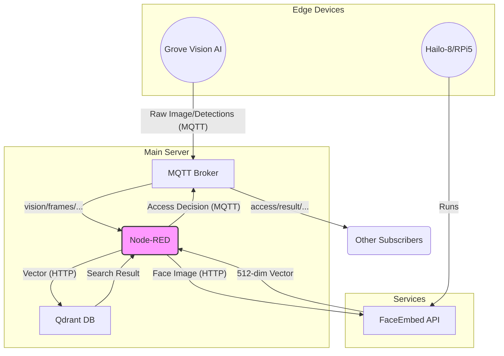

# Data Flow & Format Documentation

This document details the data flow between modules and the core data formats in the face recognition access control system. All descriptions are based on the current code implementation.

## Table of Contents
1.  [System Overview](#1-system-overview)
2.  [Core Data Flows](#2-core-data-flows)
    *   [2.1 Face Recognition Flow](#21-face-recognition-flow)
    *   [2.2 Face Enrollment Flow](#22-face-enrollment-flow)
3.  [Detailed Data Formats](#3-detailed-data-formats)
    *   [3.1 Grove Vision AI -> MQTT](#31-grove-vision-ai---mqtt)
    *   [3.2 Node-RED (Internal): Standardized Vision Frame](#32-node-red-internal-standardized-vision-frame)
    *   [3.3 Node-RED -> FaceEmbed API](#33-node-red---faceembed-api)
    *   [3.4 FaceEmbed API -> Node-RED](#34-faceembed-api---node-red)
    *   [3.5 Node-RED -> Qdrant (Vector Search)](#35-node-red---qdrant-vector-search)
    *   [3.6 Qdrant -> Node-RED (Search Results)](#36-qdrant---node-red-search-results)
    *   [3.7 Node-RED -> MQTT (Access Decision)](#37-node-red---mqtt-access-decision)
    *   [3.8 MQTT -> Node-RED (Face Enrollment)](#38-mqtt---node-red-face-enrollment)
    *   [3.9 Node-RED -> Qdrant (Enrollment)](#39-node-red---qdrant-enrollment)
    *   [3.10 Node-RED -> MQTT (Enrollment Status)](#310-node-red---mqtt-enrollment-status)

---

## 1. System Overview

The data core of the system is **Node-RED**, which orchestrates all services:
-   Receives images and detection boxes from **Grove Vision AI** (via MQTT).
-   Calls the **FaceEmbed API** (HTTP) to convert face images into vectors.
-   Searches for matching vectors in the **Qdrant** vector database (HTTP).
-   Publishes the final access decision to **MQTT**.
-   Handles face enrollment requests and stores new face vectors in **Qdrant**.



## 2. Core Data Flows

### 2.1 Face Recognition Flow

1.  **Grove Vision AI** detects a face and sends the image data and detection box data to the MQTT Broker separately.
2.  The `Grove Data Integrator` node in **Node-RED** listens to the corresponding MQTT topics and combines the image and detection boxes into a single standardized JSON object.
3.  The `Process Vision Frame` node selects the largest face from multiple faces in a single frame.
4.  The `API URL Configurator` node prepares the request and calls the `FaceEmbed API`'s `/detect_and_embed` endpoint.
5.  **FaceEmbed API** returns a 512-dimensional vector of the face.
6.  The `Prepare Vector Search` node constructs the search request for Qdrant.
7.  The `Qdrant Search` node calls Qdrant's search endpoint.
8.  The `Access Decision` node determines if there is a successful match based on the result from Qdrant and generates the final decision message.
9.  The `Publish Access Result` node publishes the decision message to the `access/result/{device_id}` MQTT topic.

### 2.2 Face Enrollment Flow

1.  An external system (e.g., an admin panel) publishes an enrollment command to the MQTT topic `access/enroll/{device_id}`.
2.  **Node-RED**'s `Process Enrollment Request` node receives the command and sets a "collecting" status.
3.  When a face is captured by the camera with that `device_id`, the `Process Vision Frame` node routes it to the enrollment flow.
4.  The `FaceEmbed API` is called to extract the face vector.
5.  The `Collect/Average/Store Vector` node collects 10 vectors and calculates their average to generate a more representative vector.
6.  This node prepares requests for Qdrant to "create collection" (if it doesn't exist) and "upsert point".
7.  The request is sent to **Qdrant**, completing the vector storage.
8.  The `Enrollment Final Status` node publishes a success or failure message to the `access/enroll_status/{device_id}` MQTT topic.

## 3. Detailed Data Formats

### 3.1 Grove Vision AI -> MQTT

The Grove Vision AI nodes (`subflow:f54138caa1c8a1ae`) are designed to output the raw image and detection results separately. The `Grove Data Integrator` node in Node-RED is responsible for merging them.

-   **Raw Image**: `msg.payload` is a Buffer object.
-   **Detection Result**: `msg.payload` is an array where each element represents a detection box.
    ```json
    // Grove Vision AI BBox Format
    [
      [x_center, y_center, width, height, confidence, class_id],
      [118,      150,      237,    175,    100,        0       ]
    ]
    ```

### 3.2 Node-RED (Internal): Standardized Vision Frame

The `Grove Data Integrator` node combines the above data sources into a unified JSON object, which serves as the basis for subsequent processing.

-   **Topic**: `vision/frames/{device_id}`
-   **Payload**:
    ```json
    {
      "ts": "2025-06-05T16:30:00Z",
      "img_b64": "base64_image_data...", // string or buffer
      "bboxes": [
        {
          "x": 1,     // BBox top-left X coordinate (integer)
          "y": 64,    // BBox top-left Y coordinate (integer)
          "w": 237,   // BBox width (integer)
          "h": 175,   // BBox height (integer)
          "score": 1.0  // Confidence score (float, 0.0-1.0)
        }
      ]
    }
    ```
    *Note: The `Grove Data Integrator` node converts the center-point bbox format to the top-left corner format.*

### 3.3 Node-RED -> FaceEmbed API

The `Process Vision Frame` node selects the largest face and prepares the request body. **Note:** While the API supports providing a `bbox`, the standard flow now uses the `/detect_and_embed` endpoint which performs detection internally.

-   **Endpoint**: `POST /detect_and_embed`
-   **Request Body**:
    ```json
    {
      "image_base64": "base64_encoded_image"
    }
    ```

### 3.4 FaceEmbed API -> Node-RED

The `FaceEmbed API` returns the extracted vector and processing information.

-   **Response Body**:
    ```json
    // Note: The API returns an array of results. 
    // The Node-RED flow processes the first element.
    [
      {
        "bbox": [100, 100, 200, 200],
        "landmarks": [ ... ],
        "embedding": [0.0123, -0.0456, ...], // 512-dim face vector (Array<float>)
        "confidence": 0.99 // Detection confidence
      }
    ]
    ```

### 3.5 Node-RED -> Qdrant (Vector Search)

The `Prepare Vector Search` node constructs a request to find similar vectors in Qdrant.

-   **Endpoint**: `POST /collections/{collectionName}/points/search`
-   **Request Body**:
    ```json
    {
      "vector": [0.0123, -0.0456, ...], // Vector from FaceEmbed API
      "limit": 3,                       // Return the top 3 most similar results
      "with_payload": true,             // Return the stored payload
      "score_threshold": 0.68           // Similarity threshold (1 - distance threshold)
    }
    ```

### 3.6 Qdrant -> Node-RED (Search Results)

Qdrant returns an array of matching points.

-   **Response Body**:
    ```json
    {
      "result": [
        {
          "id": "a1b2c3d4-e5f6-7890-1234-567890abcdef", // UUID of the matching point
          "version": 1,
          "score": 0.75, // Cosine similarity (higher is more similar)
          "payload": {
            "name": "John Doe" // Name of the person stored during enrollment
          }
        }
      ],
      "status": "ok",
      "time": 0.00123
    }
    ```

### 3.7 Node-RED -> MQTT (Access Decision)

The `Access Decision` node integrates all information to generate the final result.

-   **Topic**: `access/result/{device_id}`
-   **Payload**:
    ```json
    {
      "ts": "2025-06-05T16:30:00Z",
      "device_id": "grove_vision_ai_v2_001",
      "decision": true,                   // Access granted (boolean)
      "name": "John Doe",                  // Name of the matched person (string | null)
      "distance": 0.25,                   // Vector distance (1 - score) (float)
      "confidence": 0.99,                 // Face detection confidence (float)
      "processing_time_ms": 280,          // End-to-end total processing time (integer)
      "matched_id": "a1b2c3d4-..."        // Matched Qdrant point ID (string | null)
    }
    ```

### 3.8 MQTT -> Node-RED (Face Enrollment)

The face enrollment process is initiated by sending a message to MQTT.

-   **Topic**: `access/enroll/{device_id}`
-   **Payload**:
    ```json
    {
      "name": "Jane Smith",                  // Name of the person to enroll (string)
      "action": "start",                      // Action command (string)
      "collection": "office_entrance"         // Qdrant collection to save to (string)
    }
    ```

### 3.9 Node-RED -> Qdrant (Enrollment)

The `Collect/Average/Store Vector` and `Prepare Qdrant Upsert` nodes work together to store the averaged vector in Qdrant.

1.  **Create Collection (if it doesn't exist)**
    -   **Endpoint**: `PUT /collections/{collectionName}`
    -   **Body**: `{"vectors": {"size": 512, "distance": "Cosine"}}`
2.  **Upsert Point**
    -   **Endpoint**: `PUT /collections/{collectionName}/points?wait=true`
    -   **Body**:
        ```json
        {
          "points": [
            {
              "id": "generated-uuid-...",
              "vector": "[...]", // Averaged 512-dim vector
              "payload": { "name": "Jane Smith" }
            }
          ]
        }
        ```

### 3.10 Node-RED -> MQTT (Enrollment Status)

Node-RED publishes status updates at various stages of the enrollment process.

-   **Topic**: `access/enroll_status/{device_id}`
-   **Payload (Collecting)**:
    ```json
    {
      "status": "collecting",
      "message": "Collecting face data... (3/10)",
      "collected": 3,
      "needed": 10
    }
    ```
-   **Payload (Processing)**:
    ```json
    {
      "status": "saving",
      "message": "Data collection complete, creating collection and saving to database..."
    }
    ```
-   **Payload (Final Result)**:
    ```json
    {
      "status": "success", // or "error"
      "message": "User Jane Smith enrolled successfully!"
    }
    ``` 