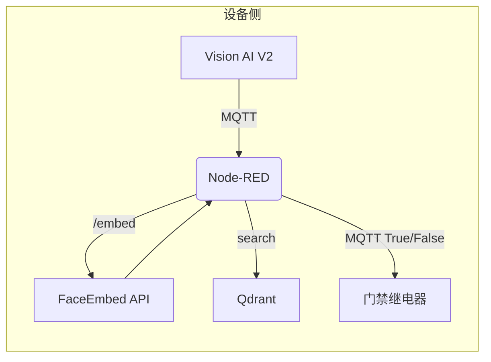

# 人脸识别权限控制系统需求文档

> **版本**：v1.0  
> **发布日期**：2025‑06‑05  
> **作者**：系统架构师

---

## 1. 背景与目标

- **核心痛点**  
  - 传统门禁依赖钥匙、卡片或密码，易丢失、易复制，管理成本高。  
  - 设备常部署于网络环境不稳定的场景，需要具备离线工作能力。  
- **产品目标**  
  - 提供基于人脸的无接触式身份核验，输出 _True/False_ 结果供下游设备控制。  
  - 支持多租户场景：每台设备可绑定独立 **Collection**。  
  - 通过 Node‑RED 流程即可完成“入库 / 查询”两种交互，无需额外 UI 开发。  

---

## 2. 用户故事

| ID | 用户 | 目标 | 可验收标准 |
|----|------|------|-----------|
| US‑01 | 管理员 | 为新用户建库 | 输入姓名→确认→10 帧采集→≥5 帧含人脸→平均向量保存 |
| US‑02 | 访客核验 | 实时判断访客是否在库 | ≤ 300 ms 返回姓名或“未知” |
| US‑03 | 安装人员 | 配置设备所属 Collection | 在 Node‑RED 设置字段后即生效 |
| US‑04 | 审计员 | 获取日志 | 导出时间戳、设备 ID、匹配结果、距离 |

---

## 3. 功能性需求

1. **F‑1**  
   - 订阅 MQTT 主题 `vision/frames/<device-id>`，消息包含 `480 × 480` JPEG 与 `bbox` 列表。  
2. **F‑2**  
   - `FaceEmbed API` 暴露 `POST /embed`，输入图像+bbox，40 ms 内输出 `512‑D float32` 向量。  
3. **F‑3**  
   - Node‑RED：  
     1. 取最大面积 bbox  
     2. 调 `/embed`  
     3. 调 Qdrant `/points/search`，余弦距离。  
4. **F‑4**  
   - 距离阈值 `τ` 可配置（默认 0.32）。  
5. **F‑5** 入库流程  
   1. 输入姓名，确认后延时 1 s；  
   2. 采集后续 10 帧；  
   3. 若 ≥ 5 帧含人脸 → 取平均向量 → `POST /points`；否则返回失败。  
6. **F‑6** 若姓名或 ID 已存在，或相似度 < 0.25，则拒绝重复入库。  
7. **F‑7** 所有 Qdrant 调用需 `api-key` 头，密钥存储于 Node‑RED 凭据库。  
8. **F‑8** 结果发布到 `access/result/<device>`：  
   ```json
   { "ts": "ISO8601", "decision": true, "name": "Alice", "distance": 0.28 }
   ```  
9. **F‑9** 心跳：每分钟发布系统状态到监控。  
10. **F‑10** 同一 Qdrant 实例可创建多个 Collection 供多租户使用。  

---

## 4. 非功能性需求（NFRs）

| 指标 | 目标 |
|------|------|
| 延迟 | Camera → Decision ≤ 300 ms (P95) |
| 吞吐 | 每设备 5 fps；每 RPi5‑Hailo8 支持 20 设备并发 |
| 可用性 | 30 天 99.5 % |
| 安全 | MQTT & REST 均启用 TLS；API Key 认证；OTA 签名 |
| 隐私 | 仅向量离开局域网；支持 GDPR 删除请求 |
| 资源 | Qdrant Docker ≤ 300 MB；512 MB RAM 足够 10 万向量 |

---

## 5. Corner Cases 列表

| 场景 | 处理策略 |
|------|----------|
| 多人同框 | 选择最大 bbox；若第二相似度接近，标记“歧义” |
| 光照差 / 模糊 | 低质量帧直接丢弃 |
| 活体检测 | 可选：深度 / IR 或 3 帧微动作检测 |
| 网络中断 | 缓存最近 50 向量，恢复后重放 |
| 重复注册 | 与库中向量距离 < 0.25 → 提示“已注册为 X” |
| Collection 不存在 | 启动时自动创建默认索引 |
| API Key 过期 | 退避重试并上报错误 |
| 时钟漂移 | NTP；漂移 > 2 min 拒绝查询 |
| 帧洪泛 | Token‑bucket 限流 5 fps |

---

## 6. 技术架构



- **Vision AI V2**：输出 480 × 480 图像与 bbox。  
- **FaceEmbed API**：运行于 RPi5 + Hailo‑8，返回 512 维向量。  
- **Node‑RED**：编排入库 / 查询逻辑。  
- **Qdrant**：向量搜索数据库 (Cosine, HNSW)。  

---

## 7. 接口定义

### 7.1 MQTT 消息

**Grove Vision AI V2 原始数据格式**：
```json
{
  "type": 1,
  "name": "INVOKE", 
  "code": 0,
  "data": {
    "count": 1259,
    "perf": [7, 48, 0],
    "boxes": [[235, 266, 480, 480, 92, 0]],
    "resolution": [480, 480],
    "image": "base64_jpeg_data",
    "rotate": 0
  }
}
```

**系统内部消息格式**：
| Topic | 方向 | Payload |
|-------|------|---------|
| `sscma/v0/<device>/tx` | Vision AI → Node‑RED | Grove Vision AI V2原始格式 |
| `vision/frames/<device>` | Node‑RED 内部处理 | `{ ts,img_b64,bboxes:[x,y,w,h,score,class_id] }` |
| `access/result/<device>` | ← Node‑RED | `{ ts,decision,name?,distance,confidence? }` |
| `access/error/<device>` | ← Node‑RED | `{ ts,code,message }` |
| `access/enroll/<device>` | → Node‑RED | `{ name,action:"start\|confirm" }` |

### 7.2 FaceEmbed API

**基于Hailo-8的人脸嵌入服务**：

| Endpoint | 方法 | Body | 响应 |
|----------|------|------|------|
| `/embed` | POST | `{image_base64, bbox: [x,y,w,h]}` | `{vector: float[512], processing_time_ms: int, confidence: float}` |
| `/health` | GET | - | `{status: "ok", model_loaded: bool, uptime_ms: int}` |
| `/batch_embed` | POST | `{images: [{image_base64, bbox}]}` | `{vectors: [float[512]], processing_times: [int]}` |

**模型配置**：
- 人脸检测：SCRFD-10G (480x480输入)
- 人脸识别：ArcFace MobileFaceNet (112x112输入)
- 输出维度：512-D float32向量
- 处理时间：< 40ms (RPi5 + Hailo-8)

### 7.3 Qdrant 交互

- **创建 Collection**  
  `PUT /collections/{col}`  
- **入库**  
  `PUT /collections/{col}/points`  
- **查询**  
  `POST /collections/{col}/points/search`  

---

## 8. 部署与运维

| 组件 | 容器镜像 | 资源 | 升级策略 |
|------|----------|------|----------|
| FaceEmbed API | `hailo/edge-rpi5` | 0.5 CPU / 256 MB | 滚动更新 |
| Qdrant | `qdrant/qdrant:v1.9-alpine` | 0.7 CPU / 1 GB | 快照 + 蓝绿 |
| Node‑RED | `nodered/node-red:3` | 0.2 CPU / 128 MB | Palette 更新 |
| 监控 | Prometheus + Grafana | 0.3 CPU / 256 MB | 同步升级 |

---

## 9. 未来规划

1. 年龄 / 性别 属性输出，支持更灵活的规则。  
2. 集成活体 CNN，提升防伪。  
3. Webhook 推送中央审计平台（ISO 27001）。  
4. 负样本在线学习，减少误报。  

---

## 10. 下一步

1. **PoC**：打通 Vision → Node‑RED → Qdrant 流程。  
2. 采集多环境样本，确定阈值 τ 的 FAR/FRR。  
3. 部署 TLS & API Key 管理。  
4. 编写安装手册与维护文档。  

---

## 11. 技术实现细节

### 11.1 Grove Vision AI V2 集成
- **MQTT主题模式**：`sscma/v0/{device_id}/tx` 和 `sscma/v0/{device_id}/rx`
- **控制命令**：`AT+INVOKE=-1,0,0` (开始推理), `AT+BREAK` (停止推理)
- **数据处理**：从480x480 JPEG提取最大人脸bbox区域
- **帧率限制**：5fps (token-bucket限流)

### 11.2 Hailo-8 人脸识别流水线
```bash
# 基于TAPPAS框架的GStreamer管道
scrfd_10g (人脸检测) → face_align (对齐) → arcface_mobilefacenet (特征提取) → gallery (匹配)
```

### 11.3 Node-RED流程设计
- **子流程1**：Vision AI V2数据接收和预处理
- **子流程2**：人脸嵌入向量计算
- **子流程3**：Qdrant向量搜索和匹配
- **子流程4**：结果发布和日志记录
- **子流程5**：人脸入库流程（10帧采集 + 平均向量）

### 11.4 性能基准
- **检测延迟**：Vision AI V2 → 结果 < 300ms (P95)
- **嵌入计算**：单张人脸 < 40ms (Hailo-8)  
- **向量搜索**：Qdrant < 10ms (10万向量)
- **系统吞吐**：每设备5fps，RPi5支持20设备并发

### 11.5 参考资料
- Grove Vision AI V2数据格式：`data/rt_respond.json`
- Node-RED处理流程：`data/access_Vision_ai.json`  
- Hailo人脸识别：`data/face_recognition.sh`
- Python异步推理：`data/detection_with_tracker.py`
- TAPPAS人脸识别：https://github.com/hailo-ai/tappas/tree/master/apps/h8/gstreamer/general/face_recognition
- Hailo代码示例：https://github.com/hailo-ai/Hailo-Application-Code-Examples/tree/main/runtime/hailo-8/python/detection_with_tracker

---
